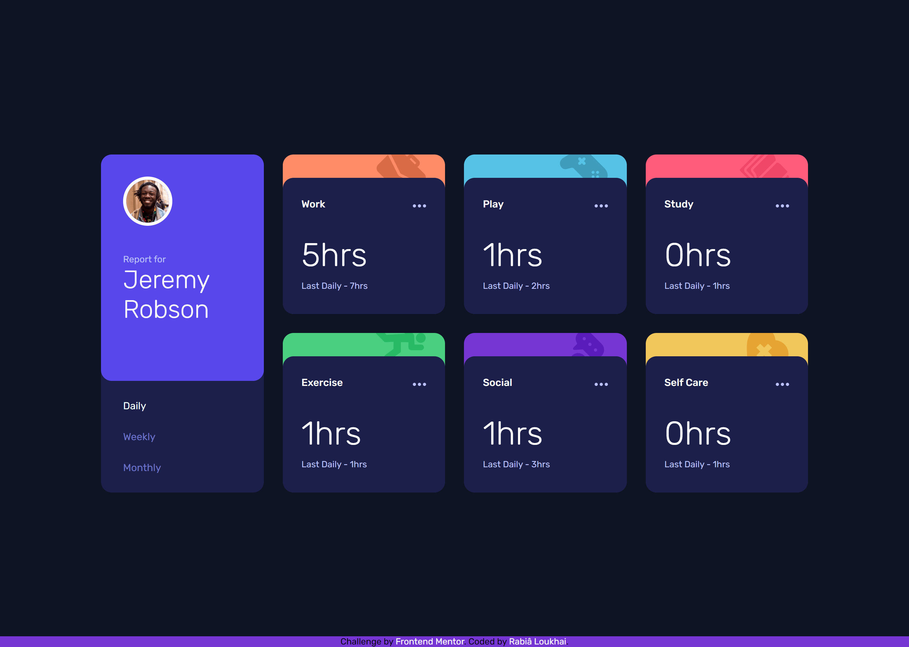

# Frontend Mentor - Time tracking dashboard solution

This is a solution to the [Time tracking dashboard challenge on Frontend Mentor](https://www.frontendmentor.io/challenges/time-tracking-dashboard-UIQ7167Jw). Frontend Mentor challenges help you improve your coding skills by building realistic projects.

## Table of contents

- [Frontend Mentor - Time tracking dashboard solution](#frontend-mentor---time-tracking-dashboard-solution)
  - [Table of contents](#table-of-contents)
  - [Overview](#overview)
    - [The challenge](#the-challenge)
    - [Screenshot](#screenshot)
    - [Links](#links)
  - [My process](#my-process)
    - [Built with](#built-with)
    - [What I learned](#what-i-learned)
    - [Continued development](#continued-development)
    - [Useful resources](#useful-resources)
  - [Author](#author)
  - [Donations](#donations)

## Overview

### The challenge

Users should be able to:

- View the optimal layout for the site depending on their device's screen size
- See hover states for all interactive elements on the page
- Switch between viewing Daily, Weekly, and Monthly stats

### Screenshot



My screenshot of solution challenge time tracker dashboard FrontendMentor.

### Links

- Solution URL: [solution In FrontEnd Mentor](https://www.frontendmentor.io/solutions/responsive-grid-layout-fetching-data-and-printing-vVghKV2mI1)
- Live Site URL: [live site](https://loukhai.github.io/FrontEndMentor_dashboard-tracker-time/)

## My process

### Built with

- Semantic HTML5 markup
- CSS custom properties
- Flexbox
- CSS Grid
- javascript pure function Vs Impure function

### What I learned

1- in Javascript:

I learn how i can do a pure function in javascript that make the code reusable & maintainable, but this code that you watch is not a pure function because it's have a side-effect,

```js
const fetchingData = async (path) => {
  let response = await fetch(path);
  let result = await response.json();
  return result;
};
```

A function must pass two tests to be considered “pure”:

- Same inputs always return same outputs.
- No side-effects.

More info in [What Is a Pure Function in JavaScript? - FreeCodeCamp](https://www.freecodecamp.org/news/what-is-a-pure-function-in-javascript-acb887375dfe/#:~:text=A%20function's%20pure%20if%20it's,leave%20the%20original%20one%20untouched.)

2- in Css:

Working with Grid Layout is not easy like what i believe, is more difficult when you need to do a responsive web, but steel an awesome css feature to design your web layout.

To distribute the trackers auto in their cells use contents display.

```css
.trackers__side {
  grid-column: span 3;
  grid-row: span 2;
  display: contents;
}
```

3- After Uploading Solution:

- All page content should be contained by landmarks : (header, footer , main, nav ).
- Element "p" not allowed as child of element "span" .

### Continued development

- I will make a pieces of the code more efficient, like memoizing async function.
- Working with a cashing data to avoid rerendering some html section(split the code to chunks = components).
- Grid Layout responsive and controllable.
- Coding with the good practicing.

### Useful resources

- [A Complete Guide to Css Grid](https://css-tricks.com/snippets/css/complete-guide-grid/) - This helped me for Grid layout. I really liked this guide.

## Author

- Website - [Rabiâ LOUKHAI](https://rabie.vercel.app)
- Frontend Mentor - [@Loukhai](https://www.frontendmentor.io/profile/Loukhai)
- Twitter - [@loukhai_rabia](https://www.twitter.com/loukhai_rabia)
- Linkedin - [Rabiâ Loukhai](https://www.linkedin.com/in/rabi%C3%A2-l-9172a2136/)

## Donations

- You can support me & buy me a coffee ❤️✨☕[https://www.buymeacoffee.com/rabialoukhai](https://www.buymeacoffee.com/rabialoukhai)
